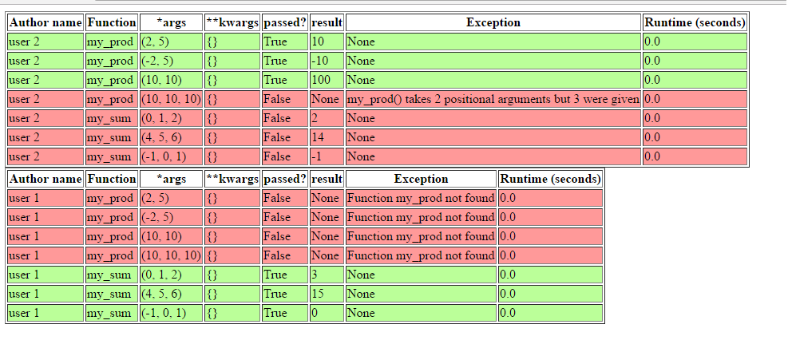

# testcase-runner

This is a framework for autmatic testing of functions and generating various raports based on the results. Basically, you should 
have a bunch of ``.py`` files with the defined ``__author__`` in each one, some standard function that you need to test, some defined 
test-cases (for example, you can tell the framework to run each ``hello_world`` function from each author with the arguments ``"Pete"``, 
then with ``"Maria"``, etc.). 

After that, the framework will output a nice-looking raport with the status of each run test-case.

## Example usage

We have a directory ``test_data`` with the following items
```python
  # content of test1.py
  __author__ = 'user 1'


  def my_sum(*args):
      return sum(args)
```
and 

```python
  # content of test2.py
  __author__ = 'user 2'


  def my_sum(*args):
      return sum(args) - 1


  def my_prod(a, b):
      return a * b

```

Next, we want to define some testcases for these files like that:

```python
    runner = TestCaseRunner("test_data", enable_logging=True)  # very verbose as I like to see what's happening there

    # some testcases for the my_sum function
    # run my_sum with the parameters 0, 1, 2 and test the result value with lambda x: x == 3
    runner.define_testcase("my_sum", lambda x: x == 3, 0, 1, 2)
    runner.define_testcase("my_sum", lambda x: x == 15, 4, 5, 6)
    runner.define_testcase("my_sum", lambda x: x == 0, -1, 0, 1)
    
    # some testcases for the my_prod function
    runner.define_testcase("my_prod", lambda x: x == 10, 2, 5)
    runner.define_testcase("my_prod", lambda x: x == -10, -2, 5)
    runner.define_testcase("my_prod", lambda x: x == 100, 10, 10)
    runner.define_testcase("my_prod", lambda x: x == 1000, 10, 10, 10)

    # run the testcases against all discovered files
    runner.run_cases()
    
    # save the result as HTML in the index.html file
    with open("index.html", "w") as f:
        runner.output_result(OUTPUT_HTML, f)

```

The outputted example is the following:


